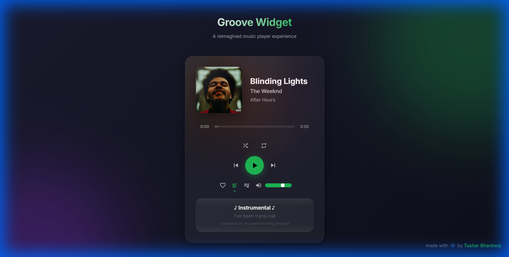
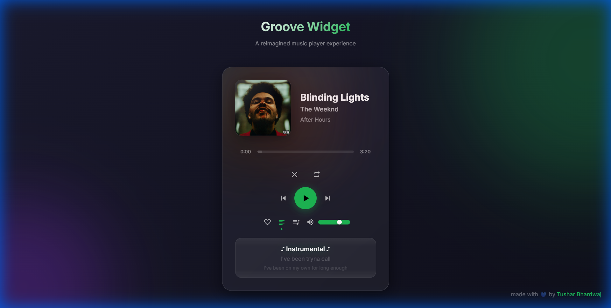
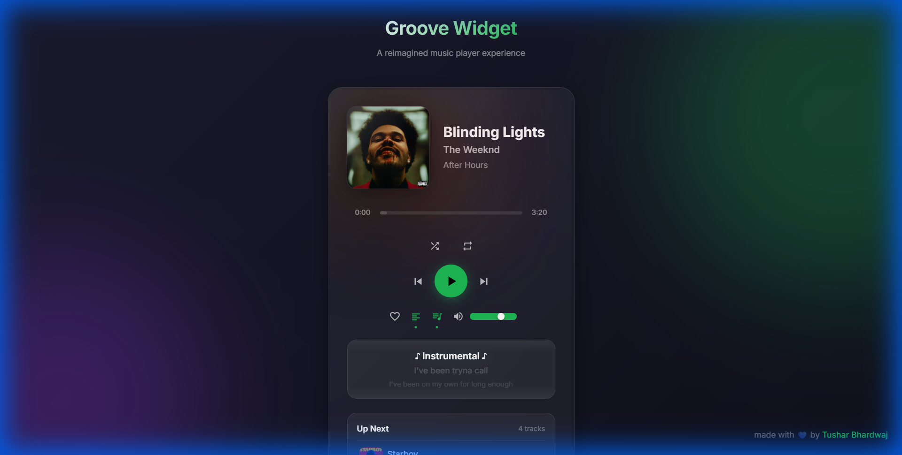

# Groove Widget

**A reimagined music player mini-widget with modern glassmorphism design and superior UX**




> **Note**: This is a UI/UX demonstration mock-up. The player simulates playback visually to showcase the interface improvements - it does not play actual audio files.


---

## The Problem

Spotify's mini-player has several UX frustrations:

| Issue | Spotify's Approach | Groove Widget's Solution |
|-------|-------------------|-------------------------|
| **Tiny progress bar** | Hard to scrub, small hit target | Large timeline with hover preview & precise drag |
| **Hidden lyrics** | Requires full-screen view | Always-visible mini lyrics that scroll in sync |
| **Buried queue** | Multiple clicks to access | Toggle-reveal upcoming tracks panel |
| **Cramped controls** | Small buttons, no feedback | Large touch targets with micro-animations |
| **No shortcuts** | Users discover by accident | Visual keyboard hints on interaction |
| **Static album art** | Just an image | Dynamic blur background, vinyl animation |

---

## Key Features

### Beautiful Glassmorphism Design
- Frosted glass aesthetic with subtle transparency
- Dynamic background blur based on album art color
- Smooth animations and micro-interactions


### Enhanced Progress Bar
- Large interactive hit area for precise scrubbing
- Hover preview tooltip shows time at cursor position
- Gradient fill with glow effect
- Click-and-drag seeking

### Mini Lyrics Display
- 3-line scrolling lyrics synced with playback
- Current line highlighted with subtle glow
- Smooth fade-in animations
- Toggleable with 'L' key



### Quick Queue Preview
- See upcoming 4 tracks at a glance
- Album art thumbnails for visual recognition  
- Click any track to skip to it
- Toggleable with 'Q' key



### Keyboard Shortcuts
| Key | Action |
|-----|--------|
| `Space` | Play/Pause |
| `Left Arrow` / `Right Arrow` | Seek 10 seconds |
| `Ctrl+Left` / `Ctrl+Right` | Previous/Next track |
| `Up Arrow` / `Down Arrow` | Volume up/down |
| `M` | Mute/Unmute |
| `L` | Toggle lyrics |
| `Q` | Toggle queue |
| `S` | Toggle shuffle |
| `R` | Cycle repeat mode |

### Delightful Interactions
- Play button pulses when playing
- Album art shows spinning vinyl in background
- Heart icon animates on like
- Progress bar expands on hover
- Smooth track transitions

---

## Tech Stack

- **React 18** - UI framework
- **Vite** - Build tool for fast development
- **Vanilla CSS** - Pure CSS with variables for design tokens
- **No external UI libraries** - Everything built from scratch

---


## Getting Started

```bash
# Install dependencies
npm install

# Start development server
npm run dev

# Build for production
npm run build
```


---


## Project Structure

```
src/
├── components/
│   ├── MusicPlayer.jsx    # Main widget orchestrator
│   ├── AlbumArt.jsx       # Album art with vinyl animation
│   ├── ProgressBar.jsx    # Enhanced timeline with preview
│   ├── Controls.jsx       # Playback buttons & volume
│   ├── MiniLyrics.jsx     # Scrolling lyrics display
│   └── QueuePreview.jsx   # Upcoming tracks panel
├── hooks/
│   └── useKeyboardShortcuts.js
├── data/
│   └── mockData.js        # Sample tracks with lyrics
├── App.jsx                # App shell with keyboard hints
└── index.css              # Design system & global styles
```

---

## Design Philosophy

1. **Progressive Disclosure** - Show essential info, reveal more on interaction
2. **Micro-interactions** - Every action feels responsive and delightful
3. **Accessibility** - Large touch targets, keyboard navigation, screen reader support
4. **Performance** - CSS animations for smooth 60fps, minimal re-renders

---

## Why This Matters

Music players are deeply personal tools we interact with daily. Small UX improvements compound into significant delight:

- **1 second saved** per interaction x **50 interactions/day** = **25+ minutes/month**
- **Visual polish** creates emotional connection with the product
- **Keyboard shortcuts** empower power users
- **Responsive design** ensures consistent experience everywhere

---

## Sponsor

If you find this helpful, consider supporting me:

- **Sponsor Me:** [Buy Me a Coffee!](https://github.com/sponsors/TuShArBhArDwA)

---

## License

This project is licensed under the MIT License - see the [LICENSE](LICENSE) file for details.

---

## Contact

- **Meet T-Bot** - [Discover My Work](https://t-bot-blush.vercel.app/)
- **Tushar Bhardwaj** - [Portfolio](https://tushar-bhardwaj.vercel.app/)
- **Connect 1:1** - [Topmate](https://topmate.io/tusharbhardwaj)
- **GitHub:** [TuShArBhArDwA](https://github.com/TuShArBhArDwA)
- **LinkedIn:** [Tushar Bhardwaj](https://www.linkedin.com/in/bhardwajtushar2004/)
- **Email:** [tusharbhardwaj2617@example.com](mailto:tusharbhardwaj2617@example.com)
